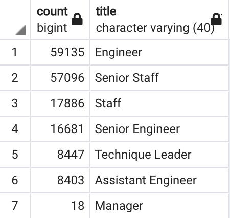
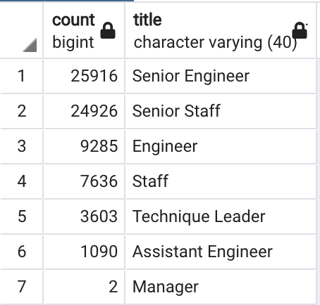

# Pewlett-Hackard-Analysis
## Overview of the Pewlett Hackard Analysis
### Purpose
The purpose of this project is to find the number of retiring employees by title and prepare the list of employees who are eligible for the mentorship program so I can help Bobby and his manager to prepare for the "silver tsunami" impact at Pewlett Hackard.

## Results
- According to unique_titles.csv, there are total of 72,458 people who are ready to retire.

- According to retiring_titles.csv, there are total of 25,916 senior engineers, 24,926 senior staffs, 9,285 engineers, 7,636 staffs, 3,603 technical leaders, 1,090 assistant engineers, and 2 managers who are retiring. 

- According to mentorship_eligibility.csv, there are total of 1,549 employees who are eligible to participate in the mentorship program. 

- From two analysis deliverables, it is hard to tell whether there are enough employees who can mentor the next generation of Pewlett Hackard so I prepared additional queries.

## Summary
According to retiring_titles.csv, the total of 72,458 roles will need to be filled as the "silver tsunami" starts to impact. From the deliverable 2, I found the list of employees who were born in 1965 and are eligible for the mentorship program. In addition to the employees who were born in 1965, I created another table, mentor_employees.csv, to show the employees who were born between January 1, 1956 and December 31, 1965. This table shows the list of employees who can be the mentors for the next generation who will replace the retiring employees. As shown on the table below, there are total of 167,666 employees who can be the mentors, which implies that there are enough employees to mentor the next generation. 
	
	- The number of employees who can be the mentors by title
	

	- The number of employees who are retiring by title  
    
